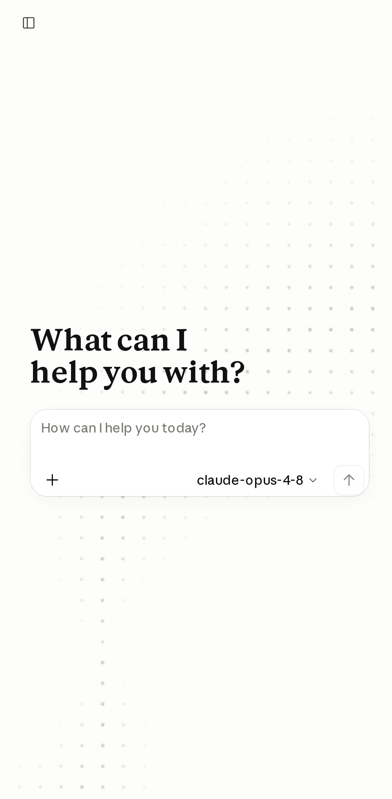
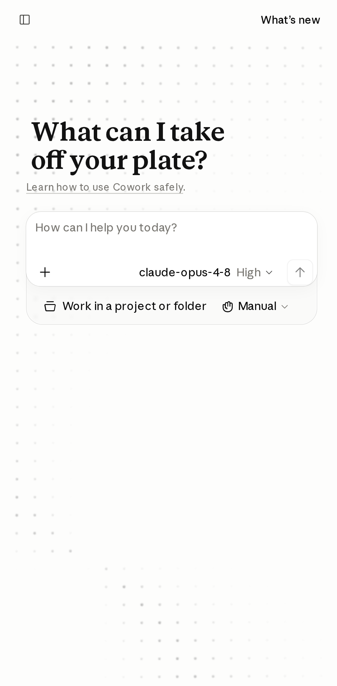
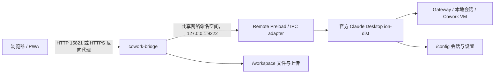

# Claude Desktop NAS

在 NAS 上以无头 Docker 容器运行 Anthropic 官方 Linux Claude Desktop，并通过轻量级 Remote IPC Bridge 在浏览器中使用 Chat、Cowork 与可选的 Code/Developer 能力。浏览器看到的是 Claude Desktop 随安装包提供的官方 `ion-dist` 界面；本项目只负责容器化、受限桥接和持久化，不重做消息渲染器。





## 适用场景

- 在 Linux/NAS 上运行官方 Claude Desktop，而不依赖物理桌面。
- 使用局域网或 Tailnet 浏览器访问 Chat 与 Cowork，并保留 Desktop 的本地会话状态。
- 在可信 HTTPS/Authelia 入口后按需打开 Gateway 设置、Developer、Infrastructure 或 Code 表面。
- 让同一份 `/config` 和 `/workspace` 数据在容器重启后继续可用。

## 工作原理



关键边界：

- `claude-desktop` 运行官方签名 APT 包、Electron/Xvfb 和 Cowork VM。
- `cowork-bridge` 只发布浏览器所需的 HTTP API；两个服务共享 `claude-desktop` 的网络命名空间。
- Bridge 到 Desktop 的方法、路径、文件类型和请求头均采用 allowlist；不接受任意 Electron action 或任意文件路径。
- Chat 与 Cowork 使用同一官方 `LocalAgentModeSessions` 管理器，但按 `sessionType` 隔离；事件通过 `GET /api/events?mode=chat|cowork&sessionId=:id` 推送。

## 浏览器入口

| 入口 | 用途 | 访问边界 |
| --- | --- | --- |
| `http://NAS_IP:15821/` | 局域网/Tailnet 直接访问 Chat、Cowork | 仅可信网络；不继承 Authelia |
| `https://claude-home.172906573.xyz:28443/` | 安装 PWA、跨网络访问 | 由现有 Nginx Proxy Manager + Authelia 保护 |

`15821` 是本 Compose 的唯一公开端口（容器内 `8080`）。HTTPS 入口需要把主机名解析到 NAS，并沿用现有 Authelia 两因素规则。浏览器可以直接使用 HTTP，但标准 PWA 安装和 Service Worker 需要 HTTPS。

## 前置条件

- Linux 主机、Docker Engine 与 Docker Compose v2。
- 可用的 `/dev/kvm` 与 `/dev/vhost-vsock`，并允许当前用户访问 KVM 组。
- 一个外部 Docker 网络 `gateway_net`：

  ```bash
  docker network inspect gateway_net >/dev/null 2>&1 || \
    docker network create gateway_net
  ```

- 可访问 Anthropic 官方 APT 源；首次构建会编译校验固定版本的 `virtiofsd` 1.13.3。
- Gateway 的 URL、API Key、认证方案和模型列表。
- 为 Cowork VM 与持久化数据预留约 25 GB 以上空间。

## 快速开始

```bash
git clone https://github.com/ump45nose/Claudesk.git
cd Claudesk
cp .env.example .env
```

编辑 `.env`，至少填写以下三项（不要把真实密钥提交到 Git）：

```dotenv
CLAUDE_GATEWAY_BASE_URL=http://gateway.example:3001
CLAUDE_GATEWAY_API_KEY=请填入你的密钥
CLAUDE_INFERENCE_MODELS_JSON='[{"name":"claude-sonnet-minimax-m3","labelOverride":"MiniMax M3","anthropicFamilyTier":"sonnet","isFamilyDefault":true}]'
```

准备 seccomp 配置、构建并启动：

```bash
./scripts/prepare-seccomp.sh
docker compose build
docker compose up -d
./scripts/smoke.sh
```

查看状态或停止：

```bash
docker compose ps
docker compose logs -f claude-desktop cowork-bridge
docker compose down
```

容器默认在启动时检查并更新官方 Claude Desktop 包（`CLAUDE_UPDATE_ON_START=1`）。如果更新源暂时不可用，启动脚本会继续使用已安装版本。

## 配置项

### 必填与基础运行

| 变量 | 默认值 | 说明 |
| --- | --- | --- |
| `COWORK_WEB_PORT` | `15821` | 宿主机公开端口，映射到 Bridge `8080` |
| `COWORK_BRIDGE_INTERNAL_PORT` | `9222` | Desktop 内部 Cowork adapter 端口，仅 loopback |
| `CLAUDE_GATEWAY_BASE_URL` | — | Gateway origin；通常不要附加 `/v1` |
| `CLAUDE_GATEWAY_API_KEY` | — | Gateway 凭据，仅写入 `.env`/受管配置 |
| `CLAUDE_GATEWAY_AUTH_SCHEME` | `bearer` | Gateway 认证方案 |
| `CLAUDE_INFERENCE_MODELS_JSON` | — | Desktop 接受的精确模型 ID JSON 数组 |
| `CLAUDE_HEADLESS` | `1` | 无头启动官方 Desktop |
| `CLAUDE_DISABLE_GPU` | `1` | NAS 环境默认关闭 GPU |

### 远程能力开关

以下能力默认关闭；打开前必须确认入口已由可信 HTTPS/Authelia 或可信 LAN/Tailnet 保护：

| 变量 | 默认值 | 打开后提供 |
| --- | --- | --- |
| `CLAUDE_REMOTE_GATEWAY_SETTINGS` | `0` | 官方第三方推理配置编辑器与 Developer 菜单入口 |
| `CLAUDE_REMOTE_DEVELOPER_ACTIONS` | `0` | MCP/Skill/Plugin 管理、日志/配置查看、调试与 trace/heap 下载等 allowlist 操作 |
| `CLAUDE_REMOTE_INFRASTRUCTURE_ACTIONS` | `0` | Projects/Spaces、Artifacts、Memory、Scheduled Tasks 等官方 mutation IPC |
| `CLAUDE_REMOTE_CODE_ACTIONS` | `0` | Code/LocalSessions、终端、权限、MCP 与 `/workspace` 文件操作 |
| `COWORK_BRIDGE_ALLOW_DESTRUCTIVE` | `0` | 是否允许 Bridge 的 destructive 方法；建议保持关闭 |

Code 命令只在 Desktop 容器内执行，默认工作根目录是挂载的 `/workspace`，不会在访问页面的手机或电脑上执行。即使启用高权限开关，Bridge 也不公开远程控制、SSH、云端 teleport、PR mutation 或自动 commit/stash/discard 等方法。

### 资源与网络

`CLAUDE_COWORK_VM_MEMORY_GB`、`CLAUDE_COWORK_VM_CPU_COUNT`、`CLAUDE_COWORK_VM_IDLE_MINUTES` 和 `CLAUDE_COWORK_VM_SCHEDULE_GUARD_MINUTES` 控制 Cowork VM 资源与空闲回收；生产默认值分别为 `2`、`1`、`30`、`10`。`CLAUDE_DESKTOP_MEMORY_LIMIT` 和 `CLAUDE_COWORK_BRIDGE_MEMORY_LIMIT` 默认分别为 `3g` 与 `256m`。

`CLAUDE_EGRESS_ALLOWED_HOSTS_JSON` 可限制 Cowork、Code 和 Plugin CLI 的出站目标。空值不额外放宽策略；`["*"]` 表示交给 NAS 防火墙与上游网络控制的 unrestricted egress。

## 官方远程接口

### 通用官方界面

- `POST /api/remote/ipc`：调用受限的 `claude.web` 方法。
- `POST /api/remote/store`：读写经过字段过滤的 Desktop store。
- `POST /api/remote/settings`：Gateway 编辑器桥接（需显式打开）。
- `GET|PUT /api/account_profile`：受限的账户资料/指令设置。
- `/api/bootstrap` 及选定的组织协议路由：转发官方启动请求。

### Chat 回退与诊断接口

- `GET /api/chat/models`
- `GET|POST /api/chat/sessions`
- `GET /api/chat/sessions/:id` 与 `/transcript`
- `POST /api/chat/sessions/:id/messages` 与 `/stop`
- `PATCH /api/chat/sessions/:id/model` 与 `/title`
- `GET /api/cowork/sessions`
- `GET /api/events?mode=chat|cowork&sessionId=:id`

这些窄接口主要用于烟雾测试、恢复和兼容；浏览器主界面仍使用官方 renderer IPC。Bridge 不直接调用 Inference Gateway，也不复制或修改 Desktop 会话文件。

## 安全边界

- 直接 `15821` 端口没有应用层认证，只应暴露在可信 LAN/Tailnet；公网访问请使用 Authelia 保护的 HTTPS 入口。
- Gateway Key 默认只留在 Desktop 容器与受管配置中，不注入浏览器 bootstrap；跨边界的请求头仅允许 `accept`、`accept-language`、`content-type`。
- destructive 方法、Developer、Infrastructure、Code 和 Gateway 编辑均采用独立显式开关，默认值为 `0`。
- Bridge 拒绝任意文件路径、通用 Electron action、凭据字段和未 allowlist 的 IPC 方法；trace/heap 与配置文件走不缓存的受限端点。
- 镜像使用 Anthropic 签名 APT 源、固定 digest 的 Rust builder、校验和固定的 `virtiofsd` 1.13.3，以及项目内的窄化 seccomp 规则；容器不使用 `--privileged`、`seccomp=unconfined` 或 `CAP_SYS_ADMIN`。
- 静态 Gateway 模式使用 `--password-store=basic` 以避免 headless 启动卡在 Keyring 解锁；不要把它当作交互式登录凭据的加密持久化方案。

## 验证与故障排查

按从快到慢的顺序运行：

```bash
# 检查容器、版本、KVM/vhost-vsock、网页和 Cowork adapter
./scripts/smoke.sh

# 检查官方 Chat/Cowork 列表、静态资源、SSE 与远程 IPC
./scripts/chat-bridge-smoke.sh

# 只检查健康状态和 Cowork 会话列表
./scripts/cowork-bridge-smoke.sh

# 校验 Docker、安全配置和脚本
./scripts/validate.sh
```

常见问题：

1. **页面打不开**：先确认 `docker compose ps` 中两个服务为 healthy，再从 NAS 本机执行 `curl -fsS http://127.0.0.1:15821/api/health`。
2. **Cowork 不可用**：检查 `/dev/kvm`、`/dev/vhost-vsock` 权限和 `claude-desktop` healthcheck；不要先关闭 seccomp。
3. **模型列表为空**：确认 `CLAUDE_INFERENCE_MODELS_JSON` 是合法 JSON，模型 ID 与 Gateway 实际接受的路由一致。
4. **PWA 无法安装**：HTTP LAN 入口可浏览但不能提供标准 Service Worker；改用 Authelia 保护的 HTTPS 主机名。
5. **配置泄露风险**：不要执行会打印渲染后环境变量的 `docker compose config`，因为其中可能包含 API Key。

## 持久化数据

Compose 默认挂载：

| 容器路径 | NAS 路径 | 内容 |
| --- | --- | --- |
| `/config` | `/vol2/1000/Docker/ClaudeDesktop/config` | Claude Desktop 配置、账户与 Chat/Cowork 会话 |
| `/workspace` | `/vol2/1000/Docker/ClaudeDesktop/workspace` | Code/Cowork 工作区、远程上传与项目文件 |

停止 Claude Desktop 后再对 `/config` 做一致性敏感的备份。Cowork VM 与工作数据可能额外占用约 25 GB，长期运行前请检查存储余量。

## 截图

仓库内的移动端截图位于：

- [`docs/screenshots/chat-mobile.png`](docs/screenshots/chat-mobile.png)：Chat 远程界面。
- [`docs/screenshots/cowork-mobile.png`](docs/screenshots/cowork-mobile.png)：Cowork 远程界面。
- [`docs/screenshots/claudesk-home.png`](docs/screenshots/claudesk-home.png)：本次验证的桌面端首页。
- [`docs/screenshots/claudesk-mobile.png`](docs/screenshots/claudesk-mobile.png)：本次验证的窄屏首页。
- [`docs/screenshots/claudesk-developer.png`](docs/screenshots/claudesk-developer.png)：Developer 的 Trace/heap 文件页。

截图来自同一 Remote Bridge，适合在移动浏览器检查响应式布局；敏感数据请在重新截屏前确认已清理。

## 开发与贡献

Bridge 源码在 `bridge/`，Electron 注入包装器在 `bridge-wrapper/`，启动脚本在 `rootfs/`。修改 IPC allowlist 时，必须同时检查外层 Bridge 和 loopback adapter，并在说明中写清楚为什么该方法需要远程暴露。

提交前至少运行 `./scripts/validate.sh` 与相关 smoke script。请不要提交 `.env`、Gateway Key、真实会话数据或 `/workspace` 里的私有文件。

## 许可证与致谢

本仓库当前未附带开源许可证；在加入许可证文件前，默认版权规则适用，公开可见不等于自动授予复制、修改或再发布权。

感谢以下项目：

- [Anthropic Claude Desktop](https://claude.ai/download)：官方客户端与 `ion-dist` 前端。
- [jlesage/docker-baseimage-gui](https://github.com/jlesage/docker-baseimage-gui)：浏览器桌面容器基础镜像。
- [virtio-fs/virtiofsd](https://gitlab.com/virtio-fs/virtiofsd)：Cowork VM 文件共享。
- [moby/profiles](https://github.com/moby/profiles)：seccomp 基础策略。
- [LINUX DO](https://linux.do/)：项目交流社区。

Claude、Claude Desktop 及相关标识是 Anthropic 的商标。本项目仅提供互操作与自托管部署代码。

