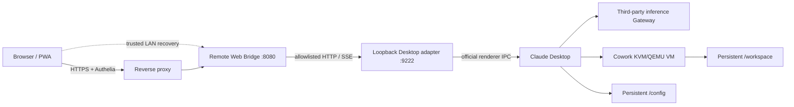

# Claudesk

> 在 NAS 上运行官方 Claude Desktop，并通过浏览器或 PWA 远程使用同一套 Chat、Cowork 与 Code 数据。

[](https://github.com/ump45nose/Claudesk/actions/workflows/validate.yml)

Claudesk 将 Anthropic 官方 Linux Claude Desktop 放进带 KVM 的 Docker 容器，通过严格白名单的 Remote IPC Bridge，把当前安装包内的官方 `ion-dist` 界面直接呈现给浏览器。它不是 noVNC，也没有重新实现一套聊天 UI。

项目支持第三方推理 Gateway、移动 Web/PWA、多端共享本地会话、官方包启动更新，以及按功能分级开放的 Projects、Artifacts、Memory、Scheduled Tasks、MCP、Plugins、Skills 与 Code 能力。

> [!IMPORTANT]
> Claudesk 是非官方社区项目，与 Anthropic 无隶属关系。仓库不包含 Claude Desktop 安装包或 `ion-dist` 静态资源；镜像构建时从 Anthropic 的签名 APT 仓库安装官方客户端。

## 界面预览

以下截图来自运行中的官方 Claude Desktop 前端，未包含域名、账号、会话标题或聊天内容。

| Chat | Cowork |
| --- | --- |
|  |  |

## 项目特色

- **官方客户端与官方界面**：安装 Anthropic 官方 Linux 包，运行时读取当前版本的 `ion-dist`，不复制、不仿制前端。
- **真正的 Remote IPC Bridge**：浏览器调用经双层方法白名单转发到官方 Electron renderer/main IPC；不直接读写 Claude 会话数据库。
- **多端共享状态**：Desktop、Web 与 PWA 使用同一个持久化 `/config`，Chat、Cowork 和 Code 会话保持一致。
- **第三方推理 Gateway**：支持官方 Desktop 的 Gateway 模式、自定义模型别名与 `bearer`/`x-api-key` 认证。
- **API Key 不下发**：默认由容器内的 root-owned managed settings 持有凭据，浏览器 bootstrap 不包含 Gateway API Key。
- **移动 Web 与 PWA**：保留官方视觉和消息模型，只注入安全区、移动布局、断线恢复和浏览器能力兼容层。
- **官方包自动更新**：每次容器启动前检查 Anthropic 签名仓库；更新失败时继续运行已安装版本。
- **功能分级开放**：Gateway 编辑、Developer、基础设施写操作与 Code 分别由独立环境变量控制，默认关闭高权限能力。
- **Cowork VM 支持**：使用 KVM、vhost-vsock、QEMU 和校验固定版本的 `virtiofsd`，无需特权容器或 `CAP_SYS_ADMIN`。
- **可审计安全边界**：本地桥只监听共享网络命名空间的 loopback；公网桥只暴露显式 allowlist，并拒绝任意路径、任意 Electron 命令和凭据字段响应。

## 工作原理



Web 请求链路为：

```text
browser -> Remote Web Bridge -> loopback-only adapter
        -> official app://localhost renderer -> Claude Desktop IPC
```

Remote Bridge 每次请求官方页面时都从当前已安装的 Desktop 包读取入口和内容哈希资源，只在 HTML 入口注入 Remote Preload Shim、PWA manifest 和少量移动端样式。官方客户端更新后，前端资源会随之切换。

## 前置条件

- Linux 主机与 Docker Engine
- Docker Compose v2
- 可用的 `/dev/kvm` 与 `/dev/vhost-vsock`
- 支持 Anthropic Messages API 语义的第三方 Gateway
- 至少 2 GiB shared memory；Cowork VM 建议额外预留约 25 GiB 磁盘空间
- HTTPS 反向代理用于 PWA；推荐同时接入 Authelia 或等价认证层

目前主要在 x86_64 Linux NAS 上验证。官方 APT 仓库也提供 arm64 包，但本项目尚未声明 arm64 端到端验证完成。

## 快速开始

```bash
git clone https://github.com/ump45nose/Claudesk.git
cd Claudesk

cp .env.example .env
mkdir -p data/config data/workspace
```

编辑 `.env`，至少填写：

```dotenv
CLAUDE_GATEWAY_BASE_URL=https://gateway.example.com
CLAUDE_GATEWAY_API_KEY=replace-me
CLAUDE_GATEWAY_AUTH_SCHEME=bearer
CLAUDE_INFERENCE_MODELS_JSON='[{"name":"claude-opus-4-8","labelOverride":"Claude Opus 4.8","anthropicFamilyTier":"opus"},{"name":"claude-opus-5","labelOverride":"Claude Opus 5","anthropicFamilyTier":"opus","isFamilyDefault":true}]'
```

确认虚拟化设备并启动：

```bash
test -r /dev/kvm && test -w /dev/kvm
test -r /dev/vhost-vsock && test -w /dev/vhost-vsock

./scripts/prepare-seccomp.sh
docker compose build
docker compose up -d
./scripts/smoke.sh
```

默认入口：

| 入口 | 地址 | 用途 |
| --- | --- | --- |
| Remote Web Bridge | `http://nas.local:15821` | 官方 Chat/Cowork WebUI、PWA 后端和 Remote IPC API |
| Desktop fallback | `http://nas.local:15820` | 临时浏览器桌面，仅用于排障 |

直接端口没有内置鉴权，只应开放在可信 LAN/Tailnet。PWA 必须通过 HTTPS 安全来源安装。

## 配置

### 基础配置

| 变量 | 默认值 | 说明 |
| --- | --- | --- |
| `WEB_PORT` | `15820` | Desktop fallback 端口 |
| `COWORK_WEB_PORT` | `15821` | Remote Web Bridge 端口 |
| `DESKTOP_BIND_ADDRESS` | `0.0.0.0` | Desktop fallback 绑定地址 |
| `BRIDGE_BIND_ADDRESS` | `0.0.0.0` | Remote Web Bridge 绑定地址 |
| `CLAUDE_CONFIG_DIR` | `./data/config` | Desktop 配置与会话持久化目录 |
| `CLAUDE_WORKSPACE_DIR` | `./data/workspace` | Cowork/Code 工作区与远程上传目录 |
| `CLAUDE_UPDATE_ON_START` | `1` | 启动时检查官方包更新 |
| `CLAUDE_UPDATE_TIMEOUT_SECONDS` | `300` | APT 更新超时 |
| `CLAUDE_GATEWAY_BASE_URL` | 必填 | Gateway origin，通常不含结尾 `/v1` |
| `CLAUDE_GATEWAY_API_KEY` | 必填 | Gateway 凭据；不要提交到 Git |
| `CLAUDE_GATEWAY_AUTH_SCHEME` | `bearer` | `bearer` 或 `x-api-key` |
| `CLAUDE_INFERENCE_MODELS_JSON` | 必填 | Gateway 接受的 Claude 模型别名数组 |
| `CLAUDE_EGRESS_ALLOWED_HOSTS_JSON` | 空 | Cowork/Code/plugin CLI 出站域名策略；`["*"]` 表示不限制目标域名 |

模型名必须是 Gateway 实际接受的路由名。部分服务商只接受来自官方 Claude 客户端的请求，因此 `curl` 返回 401 并不能替代 Desktop 内的真实推理测试。

### 高权限功能开关

| 变量 | 默认值 | 开启的能力 |
| --- | --- | --- |
| `CLAUDE_REMOTE_GATEWAY_SETTINGS` | `0` | 官方第三方推理设置页及可写 `configLibrary` |
| `CLAUDE_REMOTE_DEVELOPER_ACTIONS` | `0` | MCP 配置、Plugins、Skills、日志、trace/heap 与受限 Developer 操作 |
| `CLAUDE_REMOTE_INFRASTRUCTURE_ACTIONS` | `0` | Projects/Spaces、Artifacts、文件、Memory、Scheduled Tasks 写操作 |
| `CLAUDE_REMOTE_CODE_ACTIONS` | `0` | 官方 Code/LocalSessions、终端与 `/workspace` 文件变更 |
| `COWORK_BRIDGE_ALLOW_DESTRUCTIVE` | `0` | 其余显式标记为 destructive 的桥接方法 |

这些开关会扩大远程客户端权限。仅在 HTTPS + 强认证之后开启，并在完成设置后关闭不再需要的能力。

## HTTPS、PWA 与 Authelia

Claudesk 不内置用户认证，推荐让反向代理负责 TLS 和 AuthRequest。Nginx 代理至少需要关闭 SSE buffering：

```nginx
location / {
    auth_request /authelia;

    proxy_pass http://127.0.0.1:15821;
    proxy_http_version 1.1;
    proxy_set_header Host $host;
    proxy_set_header X-Forwarded-Proto $scheme;
    proxy_set_header X-Forwarded-For $proxy_add_x_forwarded_for;

    proxy_buffering off;
    proxy_cache off;
    proxy_read_timeout 3600s;
}
```

`/authelia` 的具体实现取决于你的反向代理布局。不要在接入认证后额外保留一个对公网可达的 `15821` 直连入口。

## Chat、Cowork 与 Code

Chat 与 Cowork 共用官方 `LocalAgentModeSessions`，但 Bridge 按 `sessionType` 隔离列表和写入路径。多个浏览器通过 SSE 接收标题、运行状态与 transcript 更新；断线时浏览器使用 HTTP snapshot 恢复。

Code 是单独的高权限能力，默认关闭。启用后命令在 Desktop 容器内执行，默认工作根目录为持久化的 `/workspace`，不会在访问 WebUI 的手机或电脑上执行。仓库没有开放远程 SSH、cloud teleport、PR mutation 或任意主进程命令。

浏览器附件先上传到 `/workspace/RemoteUploads`，再把 NAS 路径交给官方 API。`Reveal` 只能展示 NAS 工作区的只读目录视图，不能打开访问设备上的 Explorer/Finder。

## 安全模型

- Desktop adapter 固定监听 `127.0.0.1`，不发布到宿主机。
- 外层 Bridge 与 Desktop adapter 都执行独立的方法、store、protocol path allowlist。
- Gateway API Key 默认只进入 Desktop 容器，不进入浏览器 bootstrap。
- JSON 响应若包含凭据字段名会被 Bridge 拒绝。
- 文件读写限制在预设配置文件和 `/workspace` 根目录内，并拒绝路径穿越与符号链接逃逸。
- Bridge 容器丢弃全部 Linux capabilities，启用 `no-new-privileges` 和只读根文件系统。
- Desktop 容器不使用 `--privileged`、`CAP_SYS_ADMIN` 或 `seccomp=unconfined`。
- 项目 seccomp profile 基于校验固定版本的 Moby 默认策略，只增加 Chromium user namespace 与 Cowork `AF_VSOCK` 所需规则。

更多漏洞报告说明见 [SECURITY.md](SECURITY.md)。

## 自动更新与兼容性

容器启动时会：

1. 刷新 Anthropic 签名 APT 仓库；
2. 仅升级 `claude-desktop`；
3. 根据新 `app.asar` 重新注入最小入口 wrapper；
4. 从更新后的包读取官方 `ion-dist`。

Claude Desktop 的内部 IPC 不是公开稳定 API。官方更新改变 package name、入口格式或 Gateway guard 时，Claudesk 会拒绝静默注入并返回明确错误，避免运行不完整或越权的兼容补丁。

## 验证与排障

```bash
# 容器、官方包、设备和 Bridge 综合检查
./scripts/smoke.sh

# 只检查 Cowork read path
./scripts/cowork-bridge-smoke.sh

# 检查 Chat/Cowork 分类、模型和 runtime control
./scripts/chat-bridge-smoke.sh
```

常用检查：

```bash
docker compose ps
docker compose logs --tail=200 claude-desktop
docker compose logs --tail=200 cowork-bridge
curl -fsS http://127.0.0.1:15821/api/health | jq
```

不要在终端或 Issue 中粘贴 `.env`、完整 `docker compose config` 输出、Gateway API Key 或开发者配置文件。

## 项目结构

```text
.
├── Dockerfile                       # 官方 Desktop、QEMU、virtiofsd 与注入工具
├── compose.yaml                     # Desktop + Remote Web Bridge
├── bridge/server.mjs                # 公网 Bridge、allowlist、SSE 与官方前端代理
├── bridge/public/                   # Remote shim、PWA、菜单和移动端覆盖
├── bridge-wrapper/                  # loopback Electron/main-process adapter
├── rootfs/                          # 启动更新、配置与 app.asar 注入脚本
├── scripts/                         # seccomp 生成和 smoke checks
└── security/claude-desktop.json     # 生成并提交的容器 seccomp profile
```

## 已知限制

- Cowork 依赖 KVM/QEMU 和较大的 VM 镜像，不适合没有硬件虚拟化或磁盘空间紧张的主机。
- 官方 Desktop 的内部 IPC/前端结构可能随更新变化，需要持续兼容维护。
- 直连端口没有应用层鉴权；远程使用必须自行部署 TLS 与认证。
- 浏览器无法直接取得访问设备的本地文件路径，上传文件会复制到 NAS workspace。
- PWA 的离线能力只用于壳层和已访问的内容哈希静态资源；推理与会话操作仍需要连接 NAS。

## 贡献

提交 PR 前请运行：

```bash
node --check bridge/server.mjs
node --check bridge-wrapper/main.cjs
node --check bridge/public/remote-preload.js
shellcheck rootfs/startapp.sh rootfs/etc/cont-init.d/*.sh scripts/*.sh
jq -e . security/claude-desktop.json bridge/public/manifest.webmanifest
```

修改 IPC allowlist 时，请同步检查外层 Bridge 与 loopback adapter，说明为什么该方法需要远程暴露，并保持 destructive 能力默认关闭。

## License

本仓库当前未附带开源许可证。在许可证文件加入之前，默认版权规则适用；公开可见不等于自动授予复制、修改或再发布权。

## 致谢

- [Anthropic Claude Desktop](https://claude.ai/download) — 官方客户端与前端
- [jlesage/docker-baseimage-gui](https://github.com/jlesage/docker-baseimage-gui) — 浏览器桌面容器基础镜像
- [virtio-fs/virtiofsd](https://gitlab.com/virtio-fs/virtiofsd) — Cowork VM 文件共享
- [moby/profiles](https://github.com/moby/profiles) — seccomp 基础策略
  
## 社区

本项目在 [LINUX DO](https://linux.do/) 社区进行交流与发布，感谢社区提供的技术讨论环境。

Claude、Claude Desktop 及相关标识是 Anthropic 的商标。本项目仅提供互操作与自托管部署代码。
